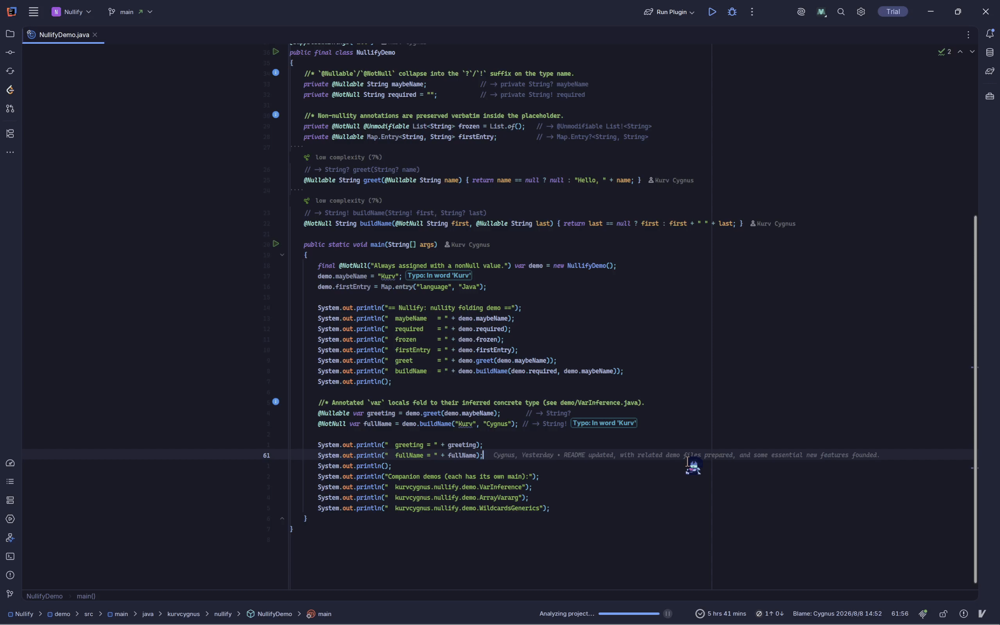

# Nullify

> Read your Java code the way it was meant to be read.\
> Nullify folds noisy annotations and wildcards into clean `?`/`!`/`out`/`in` syntax — without changing a single line of your source.


---

## Table of Contents

- [See it in action](#see-it-in-action)
- [Why Nullify?](#why-nullify)
- [Features](#features)
- [What gets folded](#what-gets-folded)
- [Installation](#installation)
- [Compatibility](#compatibility)
- [Feedback & Roadmap](#feedback--roadmap)

---

## See it in action



Type `@Nullable String`, and it folds to `String?` right before your eyes. Hover or Ctrl+click the folded text, and it still jumps to the declaration. It's just a view — your source never changes.

---

## Why Nullify?

Java's annotations are powerful, but they come with a lot of noise. A single field can pile on a wall of text:

```java
@NotNull
@Unmodifiable
private final Map<@NotNull String, @Nullable List<@NotNull Token>> cache;
```

With Nullify, that reads as:

```java
@Unmodifiable
private final Map!<String!, List?<Token!>> cache;
```

Same code. Same behavior. Only the noise is gone.

**Folding is a view, not a rewrite** — the source file stays exactly as you wrote it, so your diffs, CI, and teammates' tools all see the same Java as always.

Why you'll love it:

- **Reads like Kotlin.** `?` and `!`, `out` and `in`, clean array syntax — the compact style you already know, applied to your Java.
- **One style for the whole type system.** Nullity markers, wildcards, arrays & varargs, `var` inference, qualified types, intersection casts — all fold into one consistent, familiar look.
- **Finds annotations wherever Java hides them.** On the type, on the declaration, on the class, on the whole package — no matter which of the four spots a nullability annotation lives in, Nullify resolves it correctly.
- **Nothing breaks.** Navigation, completion, and other plugins keep working on folded code. Folded placeholders even keep non-nullity annotations like `@Value("${app.name}")` and can still jump to what they point at.
- **Catches annotation chaos.** A built-in inspection flags duplicated and mixed-library nullability annotations, with one-click fixes.
- **Your editor, your rules.** Turn each kind of folding on or off, register your own annotations, and choose the style that fits your team.

---

## Features

### 1. Nullity at a glance — `Foo?` / `Bar!`

<!--
  GIF: docs/assets/fold-nullity.gif
  Record: fold `@Nullable`/`@NotNull` in a mix of fields, parameters, and return
  types; unfold one placeholder to prove the original annotation is still there.
-->


`@Nullable Foo` → `Foo?`, `@NotNull Bar` → `Bar!`. Nullify understands annotations wherever Java puts them — on the type, the declaration, the class, or the whole package — and gets every position right.

### 2. Variance that reads itself — `out` / `in`

<!--
  GIF: docs/assets/fold-wildcards.gif
  Record: a generic signature like `List<? extends Foo>` folding to
  `List<out Foo>` and `Consumer<? super Bar>` to `Consumer<in Bar>`.
-->


`? extends Foo` → `out Foo`, `? super Bar` → `in Bar` — the same variance words Kotlin uses, so generic signatures finally read the way they *mean*.

### 3. Arrays & varargs, normalized — `Array!<String?>` / `Vararg?<Object>`

<!--
  GIF: docs/assets/fold-arrays.gif
  Record: `@NotNull String[]` folding to `Array<String!>` and a vararg parameter
  folding to `Vararg?<...>`, including multidimensional annotation placement.
-->


Arrays and varargs fold into clean generic syntax — `Array<String!>`, `Vararg?<Object>` — with every dimension's annotation placed exactly where it belongs. Nothing is flattened, nothing is misattributed.

### 4. Navigation never breaks

<!--
  GIF: docs/assets/navigation.gif
  Record: Ctrl+click (or Ctrl+B) on `Foo?` jumps to the Foo class, on the `?`
  marker jumps to the annotation declaration, and on a preserved annotation
  value literal (e.g. Spring's @Value("${app.name}")) jumps to the config key.
-->


Folding should never cost you navigation. Ctrl+click any part of a folded placeholder — the type, a type argument, the `?`/`!` marker, even a preserved annotation's value literal — and you land exactly where the IDE would have taken you before folding.

### 5. Catch annotation chaos

<!--
  GIF: docs/assets/inspection.gif
  Record: two conflicting nullability annotations on one element being flagged,
  with the quick fix replacing the non-conforming one with the file/project
  default.
-->


Nullify ships the **Inconsistent Nullability Annotation** inspection: it spots duplicated or mixed-library nullability annotations (`@javax.Nonnull` vs `@org.jetbrains.annotations.NotNull`, `@NotNullByDefault` vs `@ParametersAreNonnullByDefault`, …) and offers one-click quick fixes — remove the duplicate, or align it with the file's / project's standard annotation.

### 6. Your rules, your defaults

<!--
  GIF: docs/assets/settings.gif
  Record: opening Settings → Editor → Nullify and toggling options / registering
  a custom annotation FQCN.
-->


Under **Settings → Editor → Nullify** you control everything:

- Toggle nullity and wildcard folding independently, and pick Kotlin-style marker placement.
- Register your own `@Nullable` / `@NotNull` annotations — Nullify understands them just like the built-ins.
- Configure class/package/project-level nullability defaults (`@NotNullByDefault`, `@ParametersAreNonnullByDefault`, …).
- Built-in support for the popular libraries: JetBrains, JSpecify, Spring, AndroidX, Eclipse JDT, Checker Framework, FindBugs/SpotBugs, and more.
- FQCN inputs with code completion, and an interface that speaks your IDE's language.
- Show or hide the nullability reason hint above collapsed folds, and give it a custom color.

### 7. Reasons that stay with you

<!--
  GIF: docs/assets/reason-hint.gif
  Record: `@Nullable("returns null when no entry matches")` folding to `String?`,
  with the hint "This is nullable because "returns null when no entry matches"."
  appearing above the collapsed fold; expanding the fold makes it disappear.
-->


When Nullify collapses `@Nullable("returns null when no entry matches")` into `String?`, the reason doesn't vanish — it reappears as a hint right above the folded code: *"This is nullable because "returns null when no entry matches"."* It appears only while the fold is collapsed, resolves constant reasons too (`@Nullable(REASON)`), follows your editor's colors, and can be tuned — or switched off — under `Settings → Editor → Nullify`.

---

## What gets folded

A quick tour of the folding you'll see every day — including the less obvious spots:

| Java you write                                     | What Nullify shows                             |
|----------------------------------------------------|------------------------------------------------|
| `@Nullable Foo`                                    | `Foo?`                                         |
| `@NotNull Bar`                                     | `Bar!`                                         |
| `@Nullable Foo<@NotNull Bar>`                      | `Foo?<Bar!>`                                   |
| `? extends Foo`                                    | `out Foo`                                      |
| `? super Bar`                                      | `in Bar`                                       |
| `@NotNull String[]`                                | `Array<String!>`                               |
| `Object @Nullable ...`                             | `Vararg?<Object>`                              |
| `@Nullable Foo @NotNull []`                        | `Array!<Foo?>`                                 |
| `? extends @Nullable Foo`                          | `out Foo?`                                     |
| `@NotNull String @Nullable [] @NotNull []`         | `Array?<Array!<String!>>`                      |
| `@Nullable var name = ...`                         | `String?` (inferred type)                      |
| `@ConfigValue("${app.name}") @NotNull String`      | `@ConfigValue("${app.name}") String!`          |
| `(Serializable & @NotNull Consumer<...>)`          | `Serializable & Consumer!<in String!>`         |
| `@Nullable final var foo = ...`                    | `final String? foo` (modifier kept)            |

Nullify can even take such a complex type:
```java
@NotNull List<
    ? extends @Nullable Supplier<
        Map<
            ? extends @NotNull CharSequence,
            @Nullable Consumer<? super CharSequence>
            >
        >
    > @NotNull [] list;

// Folds to `Array!<List!<out Supplier?<Map<out CharSequence!, Consumer?<in CharSequence>>>>>`.
```

---

## Installation

**From the JetBrains Marketplace:** `Settings → Plugins → Marketplace → search "Nullify" → Install`.

**From disk:** `Settings → Plugins → ⚙️ → Install Plugin from Disk…` and select the downloaded `.zip`.

After installation, restart your IDE and open any Java file. Folding is on by default — just start reading.

---

## Compatibility

- **IDEs:** IntelliJ IDEA 2025.3.4+ (Ultimate & Community) and compatible JetBrains IDEs.
- **Language:** Java.
- **License:** [Proprietary](LICENSE.txt).

---

## Feedback & Roadmap

Found a bug? Want a feature? Nullify tracks everything transparently:

- **Issues & Feature Proposals** — [Public Tracking Repository](<PUBLIC_TRACKING_URL>)
- **Changelog** — [CHANGELOG.md](CHANGELOG.md)
- **Rate & Review** — your review on the Marketplace makes a real difference
- **Source & Contact** — [GitHub](<GITHUB_URL>) · [Kurv Cygnus](https://github.com/KurvCygnus)

---

*Made with ☕ and a healthy impatience for annotation noise.*
